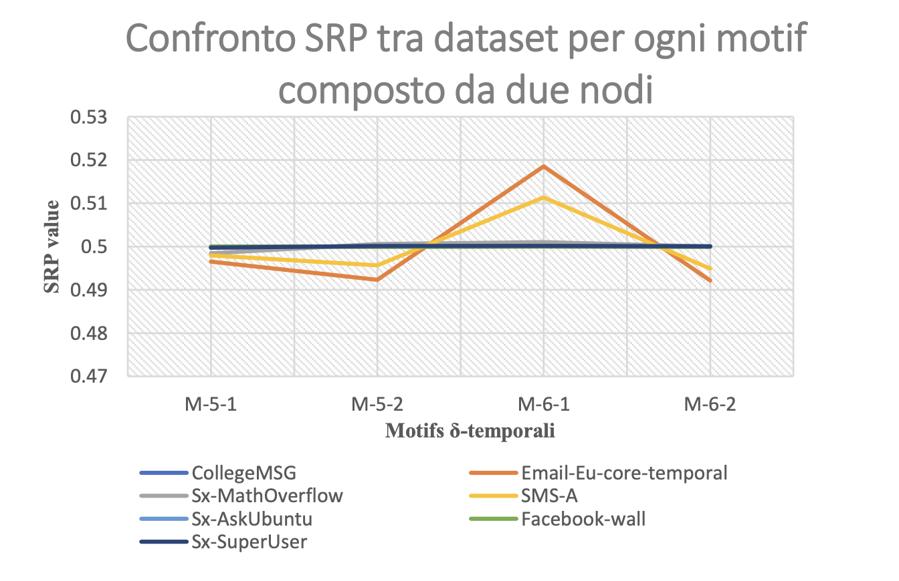
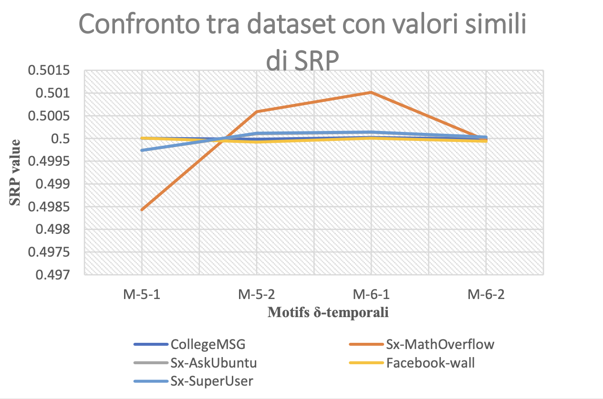
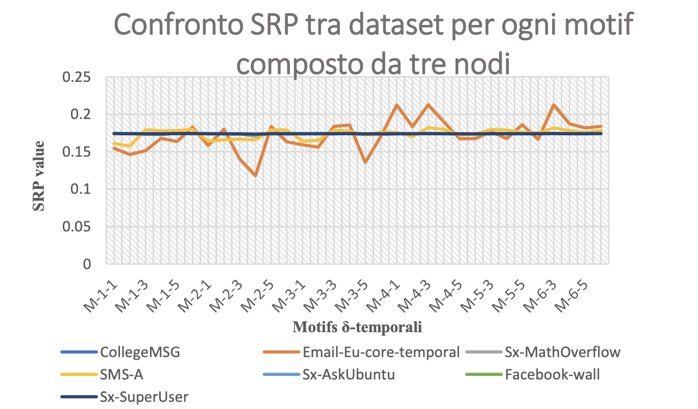
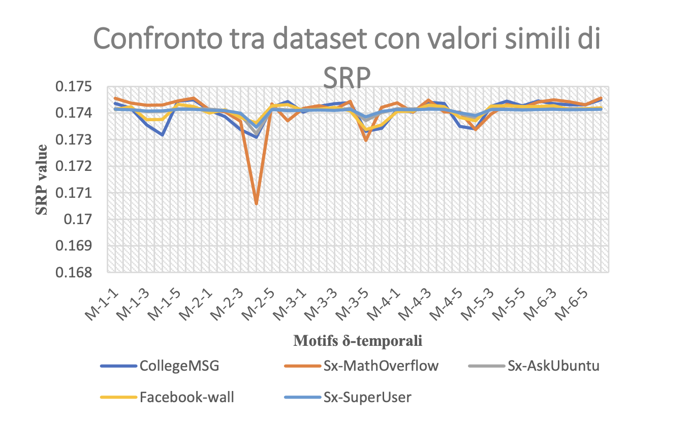

# Motif Analysis
## Goal of the Project
This program has the aim of permuting the temporal values within a given graph and subsequently calculating the motif occurrence counts. Permutation represents a crucial step in the experiment because it allows verifying whether a change in the temporal structure of the graph and, consequently, in the nature of relationships between different nodes, leads to a change in the calculation of the number of instances. The randomized permutation of the original graph will be iterated numerous times to ensure reliability in the scale of the count, which will then be compared to the count value recorded in the original network. From the values obtained in this comparison, it can be determined whether the nature of the dataset is closely linked to its structure and whether changing the temporal characteristic of the network also modifies its content and intrinsic meaning.

## Description
### Reading the Dataset
Firstly, we aim to select the dataset in a txt format through keyboard input. Each line of the text file represents an edge (i.e., a connection between two nodes, where each node is identified by an integer), accompanied by its associated integer temporal value in the new dataset. Additionally, an integer, represented as δ, will be selected via input. This δ value is essential for occurrence search.

### Counting Motif Occurrences in the Original Dataset and Extracting the Time Vector

To calculate the number of occurrences in the original dataset, an implementation of a 'backtracking algorithm' is used, and its executable is named 'exactBT.' To search for motif matches within a temporal network, this algorithm employs an approach based on the chronological ordering of edges. The search is conducted only on those edges that exhibit a temporal order reflecting that of the chosen motif.
The program requires the following inputs: a dataset, a motif choice, and a delta value. It returns the number of occurrences found and its execution time. In the preparation phase for the random permutation of temporal values of the edges, the program reads the third column of the dataset's text file and subsequently stores it in a vector.

### Permutation of the Time Vector

After obtaining a vector containing the temporal values of the network's edges at the end of the previous phase, the next step is to perform a random permutation of its elements using the Fisher-Yates algorithm.
The randomization function that selects the random number 'k' must be as random and efficient as possible to ensure a uniform distribution for all possible permutations.

### Creation of a New Dataset with Permuted Temporal Values and Subsequent Evaluation of Motif Occurrence Count

By creating a temporary file as a copy of the original dataset, we will replace the third column of the file with the new temporal values from the permuted vector. Subsequently, the 'exactBT' executable will be invoked again to evaluate the number of occurrences on the new graph.

The process of vector permutation, creation of new datasets, and reevaluation of the count will be iterated multiple times to ensure a reliable statistical analysis.

### Writing the Final Output File

For subsequent analysis, a summary output file will be generated for each motif used on the same dataset. In this file, introductory data will specify the graph's name, the motif's name, and the δ value. The central content will consist of a series of pairs (execution time; occurrence count), each representing the output of the 'exactBT' algorithm on the graph with permuted times.

## Results
Given a certain dataset, 37 motifs will be used for the analysis each categorized based on their number of nodes. The statistical descriptions will include mean, standard deviation (STD), Z-Score, SP (Significance Profile), and SRP (Subgraph Ratio Profile).

To test the different datasets, the process of timestamp permutation for each motif will be iterated 500 times, with δ set to 3200.

A high value of Z-Score, SP, or SRP for a particular motif implies that the count of its occurrences between the original and permuted graphs differs significantly. This can suggest that the network is structurally dependent on that type of model, and permuting the timestamps causes the network to lose the functional meaning it had.

  
  

  
  

## Information for running the code

### Heads-up
1. This program is used as support for a counting motif program (exactBT) written in cpp, which will not be inserted in this repository because it is currently reserved.
   
2. The program requires the use of a Linux operating system.

### Set-up
1. Insert your path into the "project_path" variable
   located in MAIN.C: The path should be identical to the one
   you would use to access this folder from the terminal. The
   path should be preceded by 'cd'.

2. To run the program, type "MAKE RUN" in the terminal
   from this folder
   (after compiling the MAKEFILE, also located in the same folder).

3. It is recommended to adjust the number of permutations
   if you want to reduce execution time, especially for large datasets.

### Additional Information:

1. The results of the program for each type of motif are
  located in the "Results" folder.

2. The "motifs" folder
  contains all the files representing motifs.

3. Within "src" and "mnp_lib",
  there are header and C files that belong to the SFMT randomization
  program (already developed). The rest of the files were created by me.

4. Doxygen documentation can be found in "doc/html/index.html".

### Architecture

To run this program, multiple computational instances will be simultaneously utilized from Google Cloud Platform: Compute Engine and Amazon Elastic Compute Cloud. The types of instances employed will be: g1-small with 1 vCPU, 1.7 GB of memory (Google) and t2.micro with 1 vCPU, 2.5 GHz, 1 GB of memory (Amazon). The operating system used will be Ubuntu 16.04, as the supporting algorithms require a Linux environment. The program is written in C, and I have used gcc v9.3.0 to compile and create my executable.

